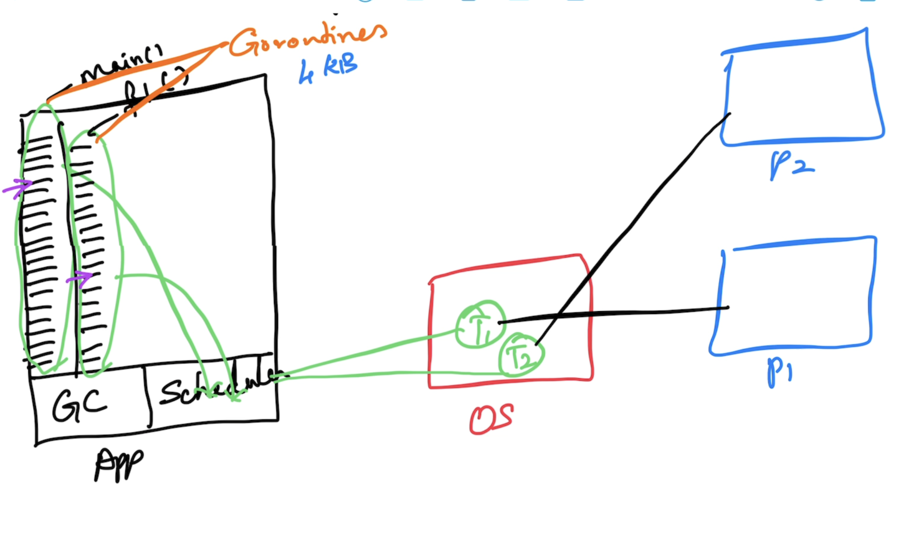

# Advanced Go

## Magesh Kuppan
- tkmagesh77@gmail.com

## Schedule
| What | When |
|------|------|
| Commence | 9:00 AM |
| Tea Break | 10:30 AM (20 mins) |
| Lunch Break | 12:30 PM (1 hr) |
| Tea Break | 3:00 PM (20 mins) |
| Wind up | 4:30 PM |

## Software Requirements
- Go Tools
- VS Code (or any editor)

## Methodology
- No powerpoints
- Code & Discuss
- No dedicated Q & A time

## Repository
- https://github.com/tkmagesh/Cisco-AdvGo-Jan-2025

## Prerequisites
- Data Types, Variables, Constants, iota
- Programming Constructs (if else, for, switch case)
- Functions
    - Higher Order Functions
    - Deferred Functions
- Errors
- Panic & Recovery
- Structs & Methods
    - Struct Composition
- Interfaces
- Modules & Packages

## Agenda
- Recap
- Concurrency
- Adv Concurreny Patterns
- Context
- Database programming choices
- HTTP Services
- GRPC Services
- Testing
- Micro benchmarking
- Profiling

## Modules & Packages
### Module
- Any code that need to versioned and deployed together
- Typically, a folder with go.mod file
- go.mod
    - manifest file for the module
    - name
        - typically, includes the complete repo path
    - go runtime version
    - dependencies
- Reference (https://go.dev/ref/mod)
#### Create a module
```shell
go mod init <module_name>
# ex:
go mod init github.com/tkmagesh/cisco-gofoundation-dec-2024/11-modularity-demo
```

#### Execute a module
```shell
go run .
```

#### Create a build
```shell
go build .
# OR
go build -o <binary_name> .
```

### Package
- Internal organization of code in a module
- Just folders
- Can be nested
- Scope can be defined at the package level

### Using OSS 
#### Add an OSS package
- By default, OSS packages are downloaded in the GOPATH/pkg folder
```shell
go get <name>
# ex:
go get github.com/fatih/color
```
#### Update the go.mod file references
```shell
go mod tidy
```
#### Only download the dependencies
```shell
go mod download
```
#### To localize the dependencies
```shell
go mod vendor
```

## Concurrency
### What is Concurrency?
- Design with more than one execution path
- Typically achieved using OS Threads
    - OS Thread ~ 2MB


### Go Concurrency
- Built in scheduler
- Concurrent operations are represented as "go routines"
- goroutines are lightweight (4 KB)

